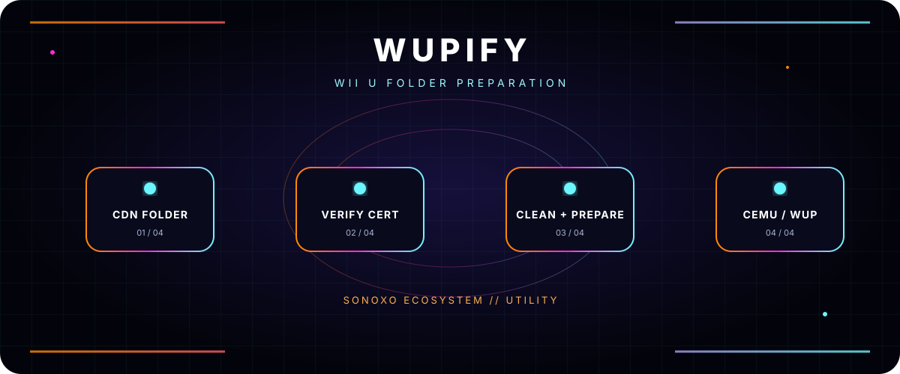

<div align="center">



# WUPIFY

**WII U FOLDER PREPARATION**

[](https://github.com/sonoxo)


</div>

## What it does

WUPify is a Python utility for cleaning and preparing **No-Intro CDN folders** for use with **Cemu** or **WUP Installer**.

## Beginner flow

1. Place `WUPify.py`, `Launch WUPify.bat`, and your legally obtained `title.cert` together.
2. Install Python 3.10+ and `cryptography`.
3. Run the batch launcher on Windows.
4. Review the prepared subfolders before using them with Cemu or copying them to `SD:\\install\\` for WUP Installer.

```bash
pip install cryptography
```

## Certificate check

You must provide `title.cert` yourself. The documented expected hashes are:

- CRC32: `0B80C239`
- MD5: `420D5E6BB1BCB09B234F02CF6A6F4597`

Use this utility only with content and keys you are legally authorized to use.

## Status

A focused folder-preparation utility—not a hosted Sonoxo service. Read the script before running it against important files.

---

<div align="center">

**SONOXO ECOSYSTEM** · Built to make complex tools understandable

The header animation automatically becomes static when your system requests reduced motion.

</div>
